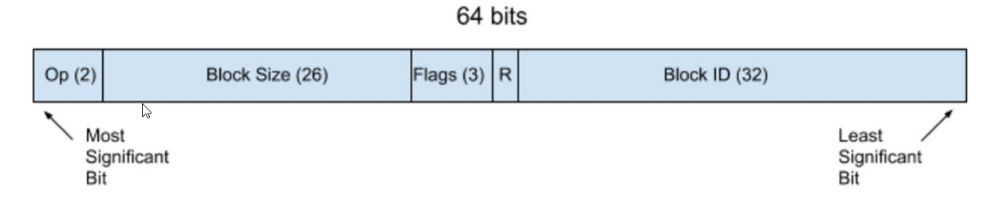
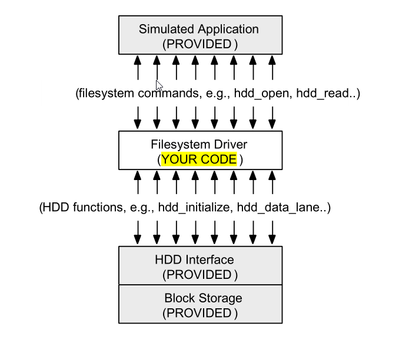

## Disclaimer!

**Due to academic Policy, I am not allowed to share the code online and will have to share code through email or other methods.**

The application was written in C utilizing:

- VM-ware: Linux 64 bit
- Bash: Utilized to automate running the application


## Contact for any Questions
- Danny Zhu
  - [Linkedin](https://www.linkedin.com/in/danny-zhu-8b6556119/),
  - chdannyzhu@yahoo.com

### What is CRUD/HDD?

CRUD is an acroynm for "Create, Remove, Update, and Delete".

HDD is an acroynm for "Hard disk drive"

The project uses the model/idea of a block storage device and asks for implementation of coded functions that mimics standard C file commands (open, close, read, write, and seek). In addition to these functions, the application was later expanded to support saving, loading, and deleting states of the HDD device: to be more precise, I created a hdd_content.svd, which will held all the device’s blocks of information. As an example, the program would be able to load in blocks of data from a previous saved state. As a final improvement to the project, I implemented network code that allowed local communication between a client and server (My computer was both the client and server. However, it would be possible to communicate over the internet between different computers with minor tweaks to the project).

As an example of one of the application's function: The program was capable of reading various text files into the program’s allocated block memory and writing it to a separate text file. It would also be capable to compare and contrast 2 text files to see if they contained the same exact text data. 
 
### What was in the block of data?



The ordering convention of memory used in the block of data was Big Endian.

The 64-bit block stressed proper allocation of bytes location as listed in the picture above.

The information was seperated into by 5 catagories.

OP stands for operation and the information stored here detailed what the program would do to the data when obtained. For example, Saving, writing, reading.


### How does this work?

**_For a more in-depth description of the application and what I needed to do, please look at the assignment PDFs_**



The device already had its own pre-defined set of functions that allowed communication with the HDD-device. My code implelmented the communication of information to the external block storage device like a hard driver (HDD).

## Features

### Checking HDD File Functions: Open, Read, Write, Close, and Delete
HDD unit tests                  
:-------------------------:
 

### Server & Client
HDDServer           |  HDD Client                    
:-------------------------:|:-------------------------:|
  |  |


### Documentation 

Each function is documented in this style and contained concise, but clear details pertaining about the function's purpose and what it did.
```
////////////////////////////////////////////////////////////////////////////////
//// Function     : ????
// Description  : ????
//
// Inputs       : ????
// Outputs      : ????
//

